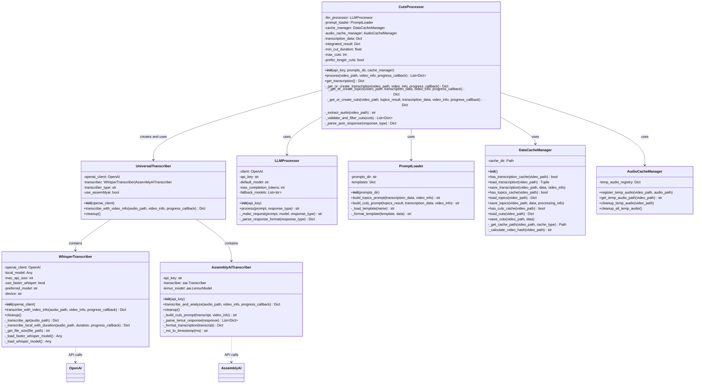
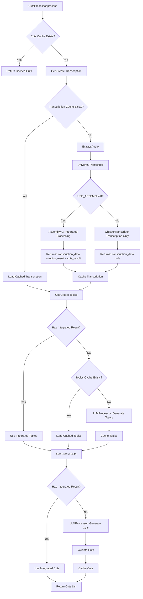

# Class Diagram - Live Video Editor

## Overview

This document contains Mermaid class diagrams showing the current architecture and the proposed AssemblyAI integration for the Live Video Editor project.

## Current Architecture

### Core Processing Classes

::: mermaid
classDiagram
    class CutsProcessor {
        -llm_processor: LLMProcessor
        -prompt_loader: PromptLoader
        -cache_manager: DataCacheManager
        -audio_cache_manager: AudioCacheManager
        -transcription_data: Dict
        -min_cut_duration: float
        -max_cuts: int
        -prefer_longer_cuts: bool
        +__init__(api_key, prompts_dir, cache_manager)
        +process(video_path, video_info, progress_callback) List~Dict~
        +get_transcription() Dict
        -_get_or_create_transcription(video_path, video_info, progress_callback) Dict
        -_get_or_create_topics(video_path, transcription_data, video_info, progress_callback) Dict
        -_get_or_create_cuts(video_path, topics_result, transcription_data, video_info, progress_callback) Dict
        -_extract_audio(video_path) str
        -_validate_and_filter_cuts(cuts) List~Dict~
        -_parse_json_response(response, type) Dict
        -_parse_timestamp(timestamp) float
        -_format_timestamp(seconds) str
    }

    class WhisperTranscriber {
        -openai_client: OpenAI
        -local_model: Any
        -max_api_size: int
        -use_faster_whisper: bool
        -preferred_model: str
        -device: str
        +__init__(openai_client)
        +transcribe(audio_path, progress_callback) Dict
        +transcribe_with_video_info(audio_path, video_info, progress_callback) Dict
        +cleanup()
        -_transcribe_api(audio_path) Dict
        -_transcribe_local(audio_path, progress_callback) Dict
        -_transcribe_local_with_duration(audio_path, duration, progress_callback) Dict
        -_choose_optimal_model(duration) str
        -_should_use_word_timestamps(duration) bool
        -_load_local_model(preferred_model)
        -_load_faster_whisper_model(preferred_model)
        -_load_standard_whisper_model(preferred_model)
        -_format_local_result(whisper_result) Dict
        -_detect_device() str
        -_optimize_pytorch()
        -_get_file_size(file_path) int
    }

    class LLMProcessor {
        -client: OpenAI
        -api_key: str
        -default_model: str
        -max_completion_tokens: int
        -fallback_models: List~str~
        +__init__(api_key)
        +process(prompt, response_type) str
        -_make_request(prompt, model, response_type) str
        -_parse_response_format(response_type) Dict
    }

    class PromptLoader {
        -prompts_dir: str
        -templates: Dict
        +__init__(prompts_dir)
        +build_topics_prompt(transcription_data, video_info) str
        +build_cuts_prompt(topics_result, transcription_data, video_info) str
        -_load_template(name) str
        -_format_template(template, data) str
    }

    class DataCacheManager {
        -cache_dir: Path
        +__init__()
        +has_transcription_cache(video_path) bool
        +load_transcription(video_path) Tuple
        +save_transcription(video_path, data, video_info)
        +has_topics_cache(video_path) bool
        +load_topics(video_path) Dict
        +save_topics(video_path, data, processing_info)
        +has_cuts_cache(video_path) bool
        +load_cuts(video_path) Dict
        +save_cuts(video_path, data)
        -_get_cache_path(video_path, cache_type) Path
        -_calculate_video_hash(video_path) str
    }

    class AudioCacheManager {
        -temp_audio_registry: Dict
        +register_temp_audio(video_path, audio_path)
        +get_temp_audio_path(video_path) str
        +cleanup_temp_audio(video_path)
        +cleanup_all_temp_audio()
    }

    CutsProcessor --> LLMProcessor : uses
    CutsProcessor --> PromptLoader : uses
    CutsProcessor --> DataCacheManager : uses
    CutsProcessor --> AudioCacheManager : uses
    CutsProcessor --> WhisperTranscriber : creates and uses
    WhisperTranscriber --> OpenAI : API calls
:::

### Current Processing Flow

::: mermaid
flowchart TD
    A[CutsProcessor.process] --> B{Cuts Cache Exists?}
    B -->|Yes| C[Return Cached Cuts]
    B -->|No| D[Get/Create Transcription]
    
    D --> E{Transcription Cache Exists?}
    E -->|Yes| F[Load Cached Transcription]
    E -->|No| G[Extract Audio with FFmpeg]
    G --> H[WhisperTranscriber Decision]
    
    H --> I{File Size > 24MB?}
    I -->|No| J[OpenAI Whisper API]
    I -->|Yes| K[Local Whisper Model]
    
    J --> L[Cache Transcription]
    K --> L
    
    F --> M[Get/Create Topics]
    L --> M
    
    M --> N{Topics Cache Exists?}
    N -->|Yes| O[Load Cached Topics]
    N -->|No| P[LLMProcessor: Generate Topics]
    P --> Q[Cache Topics]
    
    O --> R[Get/Create Cuts]
    Q --> R
    
    R --> S[LLMProcessor: Generate Cuts]
    S --> T[Validate & Filter Cuts]
    T --> U[Cache Complete Cuts]
    U --> V[Return Cuts List]
:::

## Proposed AssemblyAI Integration

### New Architecture with UniversalTranscriber



### New Processing Flow with AssemblyAI



## Key Differences

### Current Architecture
- **Sequential Processing**: Transcription → Topics → Cuts (3 separate API calls)
- **Single Transcriber**: Only WhisperTranscriber with OpenAI/local fallback
- **Cache at Each Step**: Separate caching for transcription, topics, and cuts
- **Manual Coordination**: CutsProcessor manages all phases manually

### Proposed Architecture
- **Flexible Processing**: 
  - AssemblyAI: Integrated processing (1 API call for all)
  - Whisper: Traditional sequential processing (3 API calls)
- **Universal Interface**: UniversalTranscriber abstracts the complexity
- **Intelligent Fallback**: Automatically falls back to Whisper if AssemblyAI fails
- **Transparent Integration**: CutsProcessor logic remains mostly unchanged
- **Cache Compatibility**: Full compatibility with existing cache system

## Environment Configuration

### Current Configuration
```bash
USE_FASTER_WHISPER=true
WHISPER_MODEL=large-v3
OPENAI_API_KEY=your_openai_key
```

### Proposed Configuration
```bash
# Transcription Service Selection
USE_ASSEMBLYAI=false          # Primary choice
USE_FASTER_WHISPER=true       # Fallback if AssemblyAI disabled

# AssemblyAI Configuration (only if USE_ASSEMBLYAI=true)
ASSEMBLYAI_API_KEY=your_assemblyai_key

# Whisper Configuration (fallback)
WHISPER_MODEL=large-v3
OPENAI_API_KEY=your_openai_key
```

## Benefits of the New Architecture

1. **Performance**: AssemblyAI processes large files much faster than local models
2. **Scalability**: Supports files up to 10GB without hardware limitations
3. **Integration**: Single API call for complete analysis reduces complexity
4. **Compatibility**: Maintains full backward compatibility with existing code
5. **Flexibility**: Easy switching between services via environment variables
6. **Reliability**: Automatic fallback ensures the system always works

## Implementation Impact

### Files to Create
- `src/core/universal_transcriber.py` - New universal interface
- `src/core/assemblyai_transcriber.py` - AssemblyAI integration
- `docs/ASSEMBLYAI_INTEGRATION.md` - Documentation
- `test_assemblyai_integration.py` - Testing suite

### Files to Modify
- `src/core/cuts_processor.py` - Use UniversalTranscriber instead of WhisperTranscriber
- `requirements-base.txt` - Add assemblyai dependency
- `.env.example` - Add AssemblyAI configuration

### Files Unchanged
- All UI components
- Cache management system  
- Video processing utilities
- Existing prompt templates
- Main application logic

This architecture preserves the existing functionality while adding powerful new capabilities for faster and more scalable video processing.
